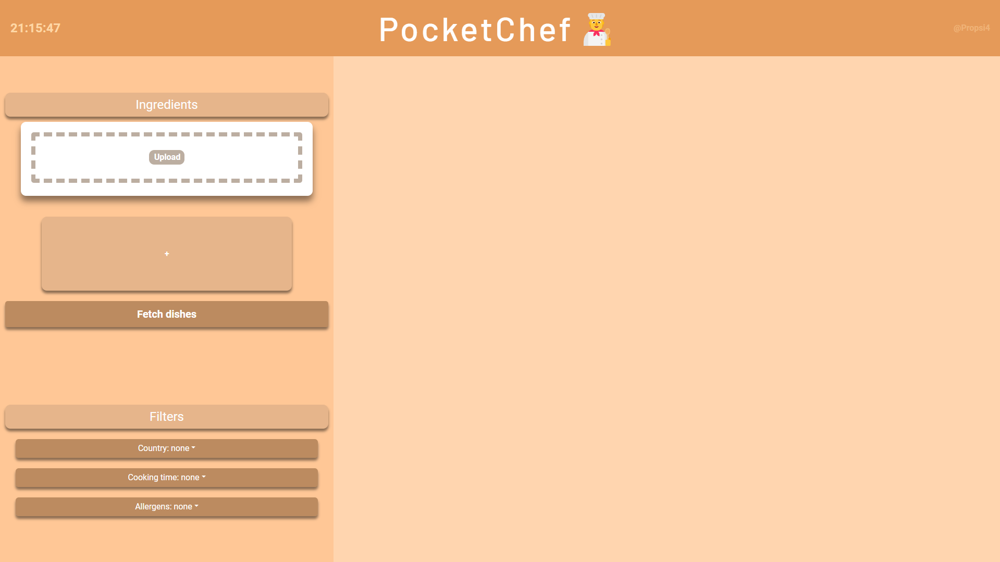
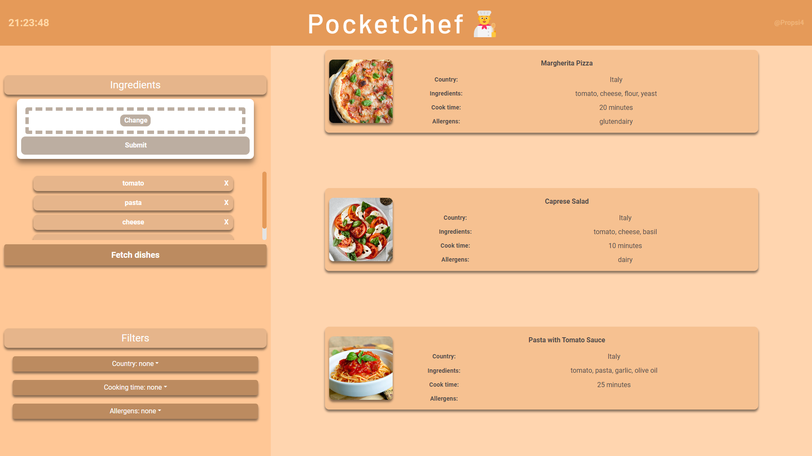
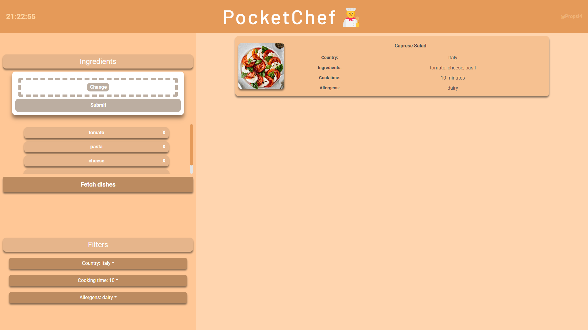

# PocketChef🧑‍🍳

PocketChef is an app that helps you find dishes based on the ingredients you have at home. It is a simple and easy-to-use app that allows you to search for dish by entering the ingredients or using the ML solution to extract available ingredients from your photo at home. You can also save your favorite dishes.

## Features
- Search for dishes by entering ingredients
- Use YOLOv8 to extract available ingredients from your photo
- Save your favorite dishes
- Web app using React.js
- Backend using FastAPI
- Swagger API documentation

## Installation
1. Clone the repository
```bash
git clone <repo-url>
```
2. Install the dependencies
```bash
cd backend
pip install -r requirements.txt
cd ../frontend
npm install
```

## Usage
1. Copy your ChatGPT Session Token to the backend folder backend/.env file. Instructions on how to get the token can be found [here](https://github.com/theAbdoSabbagh/UnlimitedGPT/blob/main/docs/README.md)
2. Run the backend
```bash
cd backend
python app.py
```
3. Run the frontend
```bash
cd frontend
npm start
```
4. Open the app in your browser at http://localhost:3000

## API Documentation
The API documentation can be found at http://localhost:8000/docs\

## Screenshots
### Home


### Fetch dishes


### Filter dishes



